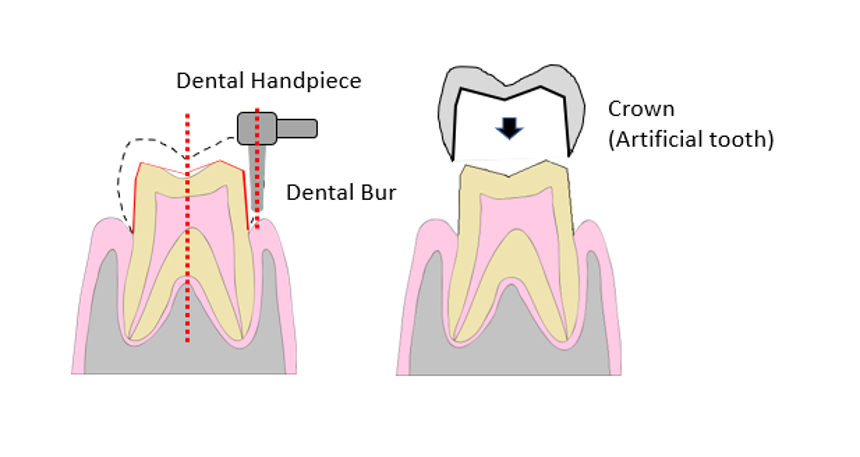

# AR-Based Tooth Preparation Training System

> Rongxuan He, Zhaomeng Zhang
> 
> Mentors: Yihao Liu, Mingxu Liu, Alejandro Martin-Gomez

This repository contains the final project for EN.601.654 Introduction to Augmented Reality in Fall 2023 at Johns Hopkins University.

<p >
  
</p>


## Project Overview

The project aims to develop an Augmented Reality (AR)-based Tooth Preparation System, providing dentists with a platform to practice tooth preparation procedures without needing real or 3D-printed teeth.

<p align="center">
  
</p>


## Repo Structure


This repository is organized into two Unity projects:
1. `Calibration`.
2. `Real-Time-System`.

Each project includes a `python-scripts` folder containing Python code that needs to be executed before starting the Unity projects. Please ensure the required Python packages are installed by referring to the [requirements.txt](requirements.txt) file.

## Prerequisites

### Hardware
1. NDI Camera
2. Microsoft Hololens2
     - Remember to open Research Mode for Hololens to get access to sensor data.

### Software
1. Unity Environment (recommended Version: 2021.3.23)
2. Holographic Remoting App on Hololens.
3. Python on PC (download required packages using `pip install -r requirements.txt`)
4. ROM files of markers fixed on tooth model, Hololens, and Dental handpiece.

## How to Run Code

### Calibration

1. Open [HololensCalibration.py](./Calibration/python-scripts/HololensCalibration.py). Make sure the paths of the ROM files are correct, and modify the HOST IP on line 18 to the IP address of your PC.
2. Open the Calibration project in Unity, open the `TrackingSample` scene, and modify the IP address in the Inspector window under the GameObject `MixedRealityPlayspace -> SampleTool`.
3. Build and deploy the project on the Hololens.
4. Remember to run the [HololensCalibration.py](./Calibration/python-scripts/HololensCalibration.py) first and run the Calibration project on Hololens.
5. When you see stable tracking of the tooth model, you can keep pressing the keyboard `S` to start recording transformation information until a `Recording` is printed in the terminal. If you want to stop collecting data, press the keyboard `Q`. The script will print the output transformation you can directly paste into [ToothDrilling.py](./Real-Time-System/python-scripts/ToothDrilling.py) on line 40.

### Real-time System

1. Open [ToothDrilling.py](./Real-Time-System/python-scripts/ToothDrilling.py) and Real-Time-System project in Unity. Make sure the paths of the ROM files are correct.
2. Start the Holographic Remoting App on Hololens and input this address into the Unity project (Mixed Reality -> Remoting -> Holographic Remoting for Play Mode -> Remote Host Name).
3. Run [ToothDrilling.py](./Real-Time-System/python-scripts/ToothDrilling.py) first, then click the `Play` button in Unity. The program will run if the markers on Hololens and Tooth are in the NDI camera range.
4. When the virtual projection is stable, click the keyboard `K`, and then you can let the markers on Hololens out of the camera range. But this time, you need to keep the markers on the tooth model and dental handpiece in the range of the camera. Then, you can enjoy the simulation of dental drilling!


## Citation

[1] A. Keller, HoloLens 2 Infrared Retro-Reflector Tracking. https://github.com/andreaskeller96/HoloLens2-IRTracking, 2023. [Online]. Available: https://github.com/andreaskeller96/HoloLens2-IRTracking

```BibTeX
@misc{keller2023hl2irtracking,
  author =       {Andreas Keller},
  title =        {HoloLens 2 Infrared Retro-Reflector Tracking},
  howpublished = {\url{https://github.com/andreaskeller96/HoloLens2-IRTracking}},
  year =         {2023}
}
```


[2] Martin-Gomez, A., Li, H., Song, T., Yang, S., Wang, G., Ding, H., ... & Armand, M. (2023). STTAR: surgical tool tracking using off-the-shelf augmented reality head-mounted displays. *IEEE Transactions on Visualization and Computer Graphics*.

```BibTex
@article{martin2023sttar,
  title={STTAR: surgical tool tracking using off-the-shelf augmented reality head-mounted displays},
  author={Martin-Gomez, Alejandro and Li, Haowei and Song, Tianyu and Yang, Sheng and Wang, Guangzhi and Ding, Hui and Navab, Nassir and Zhao, Zhe and Armand, Mehran},
  journal={IEEE Transactions on Visualization and Computer Graphics},
  year={2023},
  publisher={IEEE}
}
```

[3] Ai, L., Liu, Y., Armand, M., Kheradmand, A., & Martin-Gomez, A. (n.d.). On the Fly Robotic-assisted Medical Instrument Planning and Execution using Mixed Reality. Under review.
